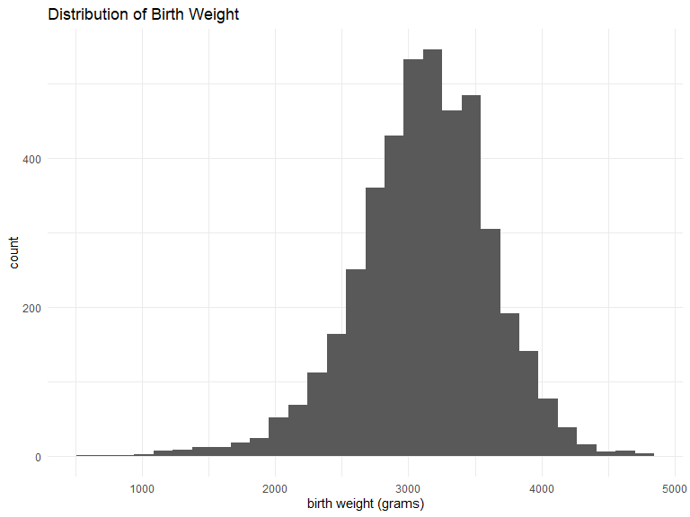
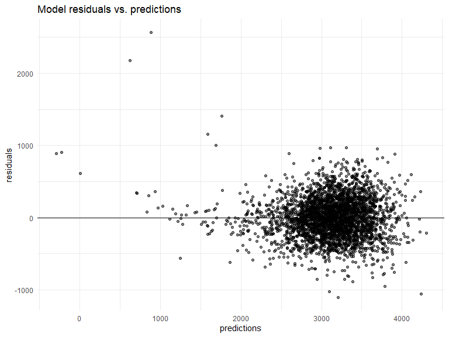
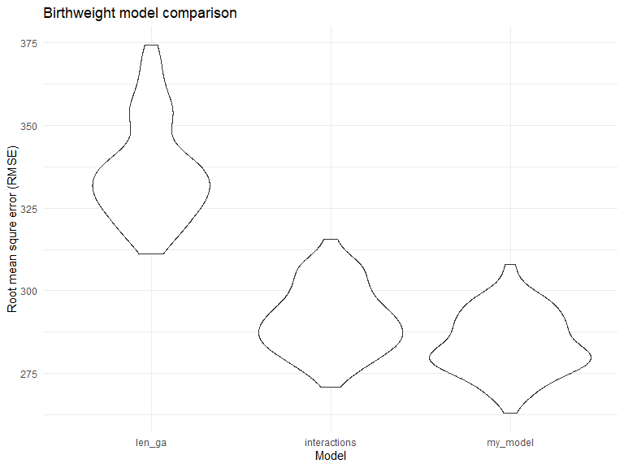
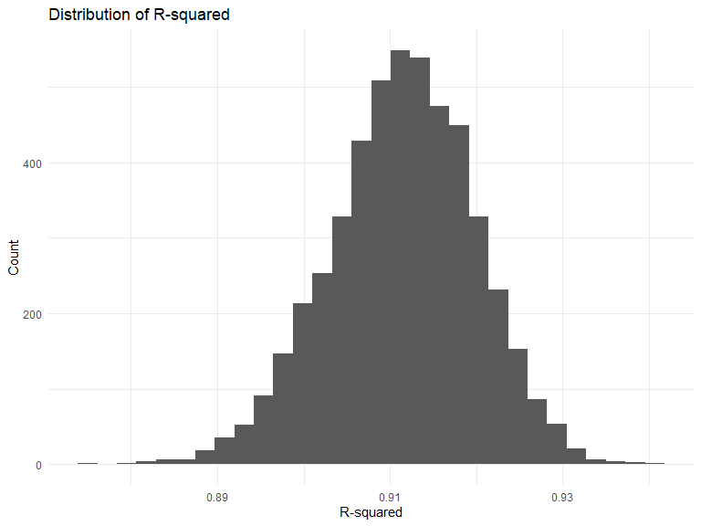
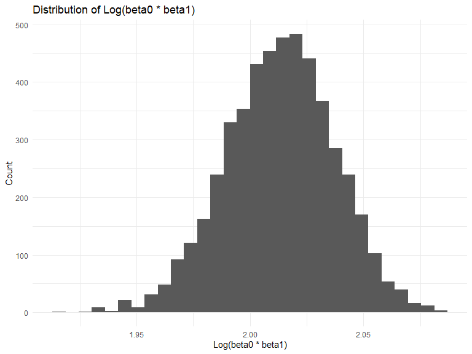

Homework 6
================
Ford Holland
11/15/2019

## Problem 1

``` r
df_birthweight = 
  read_csv("data/birthweight.csv") %>% 
  mutate(
    ft_babysex = factor(babysex, labels = c("male", "female")),
    ft_frace = factor(frace, labels = c("White", "Black", "Asian", "Puerto Rican", "Other")),
    ft_malform = factor(malform, labels = c("absent", "present")),
    ft_mrace = factor(mrace, labels = c("White", "Black", "Asian", "Puerto Rican"))
  )
```

    ## Parsed with column specification:
    ## cols(
    ##   .default = col_double()
    ## )

    ## See spec(...) for full column specifications.

``` r
df_birthweight %>% count(babysex, ft_babysex)
```

    ## # A tibble: 2 x 3
    ##   babysex ft_babysex     n
    ##     <dbl> <fct>      <int>
    ## 1       1 male        2230
    ## 2       2 female      2112

``` r
df_birthweight %>% count(frace, ft_frace)
```

    ## # A tibble: 5 x 3
    ##   frace ft_frace         n
    ##   <dbl> <fct>        <int>
    ## 1     1 White         2123
    ## 2     2 Black         1911
    ## 3     3 Asian           46
    ## 4     4 Puerto Rican   248
    ## 5     8 Other           14

``` r
df_birthweight %>% count(malform, ft_malform)
```

    ## # A tibble: 2 x 3
    ##   malform ft_malform     n
    ##     <dbl> <fct>      <int>
    ## 1       0 absent      4327
    ## 2       1 present       15

``` r
df_birthweight %>% count(mrace, ft_mrace)
```

    ## # A tibble: 4 x 3
    ##   mrace ft_mrace         n
    ##   <dbl> <fct>        <int>
    ## 1     1 White         2147
    ## 2     2 Black         1909
    ## 3     3 Asian           43
    ## 4     4 Puerto Rican   243

``` r
df_birthweight %>% 
  ggplot(aes(x = bwt)) +
  geom_histogram() +
  labs(title = "Distribution of Birth Weight",
       x = "birth weight (grams)")
```

    ## `stat_bin()` using `bins = 30`. Pick better value with `binwidth`.



I started the modeling process by plotting the distribution of birth
weight. Since it looked approximately normal I decided a linear model
would be appropriate. Next I created plots to determine which features
in the dataset might be correlated with birth weight. I chose several of
these features and created a linear model to compare the estimated
effect sizes and p values. Based on these comparisons I eliminated
features to arrive at the specification of `my_model` below.

The model uses the other birth measurements, sex, average number of
cigarettes smoked, mother’s age, gestational age, and weight gained
during pregnancy to predict birth weight.

``` r
my_model = lm(bwt ~ bhead +
                blength +
                babysex +
                smoken +
                momage +
                gaweeks +
                wtgain,
              data = df_birthweight)

broom::tidy(my_model) %>% 
  janitor::clean_names() %>% 
  knitr::kable(digits = 2)
```

| term        |  estimate | std\_error | statistic | p\_value |
| :---------- | --------: | ---------: | --------: | -------: |
| (Intercept) | \-6232.50 |     100.04 |   \-62.30 |        0 |
| bhead       |    136.95 |       3.53 |     38.79 |        0 |
| blength     |     79.60 |       2.06 |     38.61 |        0 |
| babysex     |     34.11 |       8.72 |      3.91 |        0 |
| smoken      |    \-2.28 |       0.58 |    \-3.91 |        0 |
| momage      |      7.55 |       1.12 |      6.71 |        0 |
| gaweeks     |     12.65 |       1.50 |      8.41 |        0 |
| wtgain      |      3.85 |       0.40 |      9.55 |        0 |

The model residuals are generally distributed evenly against the
predictions, although there are a few potential outliers and variance
may increase slightly with predicted value. It’s worth noting that there
are 3 values predicted as less than or near 0. These values have some of
the lowest measurements for baby head circumference and length in the
dataset.

``` r
cv_df = 
  crossv_mc(df_birthweight, 100)

cv_df =
  cv_df %>% 
  mutate(
    train = map(train, as_tibble),
    test = map(test, as_tibble))

cv_df %>%
  pull(train) %>% 
  .[[1]] %>%
  as_tibble %>% 
  mutate(id = seq.int(nrow(.))) %>%
  add_predictions(my_model) %>% 
  add_residuals(my_model) %>% 
  ggplot(aes(x = pred, y = resid)) + 
  geom_point(alpha = .5) +
  geom_hline(yintercept = 0) + 
  labs(title = "Model residuals vs. predictions", 
       x = "predictions",
       y = "residuals")
```



``` r
cv_df = 
  cv_df %>% 
  mutate(
    mod_len_ga = 
      map(train, ~lm(bwt ~ blength + gaweeks, data = .x)),
    mod_interactions = 
      map(train, 
          ~lm(bwt ~ 
                bhead + 
                blength + 
                babysex +
                bhead * blength +
                bhead * babysex +
                blength * babysex +
                bhead * blength * babysex,
              data = .x)),
    my_model =
      map(train,
          ~lm(bwt ~
                bhead +
                blength +
                babysex +
                smoken +
                momage +
                gaweeks +
                wtgain,
              data = .x))
  ) %>% 
  mutate(
    rmse_len_ga = map2_dbl(mod_len_ga, test, ~rmse(model = .x, data = .y)),
    rmse_interactions = map2_dbl(mod_interactions, test, ~rmse(model = .x, data = .y)),
    rmse_my_model = map2_dbl(my_model, test, ~rmse(model = .x, data = .y))
  )
```

The simplest prescribed model using just birth length and gestational
age has the highest RMSE. My model performs similarly to the prescribed
interaction model with slightly lower RMSE.

``` r
cv_df %>% 
  select(starts_with("rmse")) %>% 
  pivot_longer(
    everything(),
    names_to = "model", 
    values_to = "rmse",
    names_prefix = "rmse_") %>% 
  mutate(model = fct_inorder(model)) %>% 
  ggplot(aes(x = model, y = rmse)) + geom_violin() +
  labs(title = "Birthweight model comparison",
       x = "Model",
       y = "Root mean squre error (RMSE)")
```



## Problem 2

``` r
weather_df = 
  rnoaa::meteo_pull_monitors(
    c("USW00094728"),
    var = c("PRCP", "TMIN", "TMAX"), 
    date_min = "2017-01-01",
    date_max = "2017-12-31") %>%
  mutate(
    name = recode(id, USW00094728 = "CentralPark_NY"),
    tmin = tmin / 10,
    tmax = tmax / 10) %>%
  select(name, id, everything())
```

    ## Registered S3 method overwritten by 'crul':
    ##   method                 from
    ##   as.character.form_file httr

    ## Registered S3 method overwritten by 'hoardr':
    ##   method           from
    ##   print.cache_info httr

    ## file path:          C:\Users\hollanj3\AppData\Local\rnoaa\rnoaa\Cache/ghcnd/USW00094728.dly

    ## file last updated:  2019-09-03 10:46:50

    ## file min/max dates: 1869-01-01 / 2019-08-31

``` r
bootstrap = weather_df %>% 
  modelr::bootstrap(n = 5000) %>%
  mutate(
    models = map(strap, ~lm(tmax ~ tmin, data = .x)),
    r_sq = map(models, broom::glance),
    log_beta = map(models, broom::tidy)) %>% 
  select(-strap, -models) %>% 
  unnest(r_sq, log_beta) %>% 
  janitor::clean_names() %>% 
  select(id, r_squared, term, estimate) %>% 
  pivot_wider(id_cols = c(id, r_squared), 
              names_from = term, 
              values_from = estimate) %>% 
  rename(beta_0 = `(Intercept)`,
         beta_1 = tmin) %>%
  mutate(log_b0_b1 = log(beta_0 * beta_1)) 
```

``` r
ggplot(data = bootstrap, aes(x = r_squared)) + 
  geom_histogram() +
  labs(x = "R-squared",
       y = "Count",
       title = "Distribution of R-squared")
```



``` r
rsq_summary = bootstrap %>% 
  summarize(rsq_mean = round(mean(r_squared), 2),
            rsq_var = round(var(r_squared), 2),
            rsq_lower = round(quantile(r_squared, probs = 0.025), 2),
            rsq_upper = round(quantile(r_squared, probs = 0.975), 2)) 

rsq_summary %>%
  knitr::kable()
```

| rsq\_mean | rsq\_var | rsq\_lower | rsq\_upper |
| --------: | -------: | ---------: | ---------: |
|      0.91 |        0 |       0.89 |       0.93 |

R-squared is approximately normally distributed with mean 0.91 and
variance 0 (rounded).

The 95% confidence interval for R-squared is 0.89 to 0.93.

``` r
ggplot(data = bootstrap, aes(x = log_b0_b1)) + 
  geom_histogram() +
  labs(x = "Log(beta0 * beta1)",
       y = "Count",
       title = "Distribution of Log(beta0 * beta1)")
```



``` r
logb0b1_summary = bootstrap %>% 
  summarize(logb0b1_mean = round(mean(log_b0_b1), 2),
            logb0b1_var = round(var(log_b0_b1), 2),
            logb0b1_lower = round(quantile(log_b0_b1, probs = 0.025), 2),
            logb0b1_upper = round(quantile(log_b0_b1, probs = 0.975), 2)) 

logb0b1_summary %>% 
   knitr::kable()
```

| logb0b1\_mean | logb0b1\_var | logb0b1\_lower | logb0b1\_upper |
| ------------: | -----------: | -------------: | -------------: |
|          2.01 |            0 |           1.97 |           2.06 |

Log(beta0\*beta1) is also approximately normally distributed with mean
2.01 and variance 0 (rounded).

The 95% confidence interval for log(b0 \* b1) is 1.97 to 2.06.

<br> <br>
